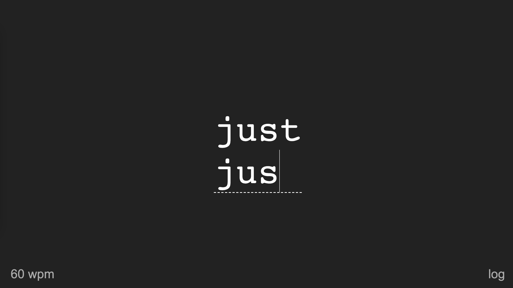

# Keyboard Drill 

Try on [Keyboard-Drill.com](https://keyboard-drill.com)

This application is training you to type individual words faster. You will see that your typing is usually always getting stuck on the same words or letter combinations. You might always make the same mistakes. Take your time and only move to the next word once you have achieved the right typing speed for the current word.

Controls:
[Space] or [Enter] to complete a word.
[Esc] to move on to a next word

Click [wpm] to set your target speed. The default is quite low but you might still find words that you can't type within the time limit.
Click [log] to see a log of your individual attempts.

Have fun! 💻
